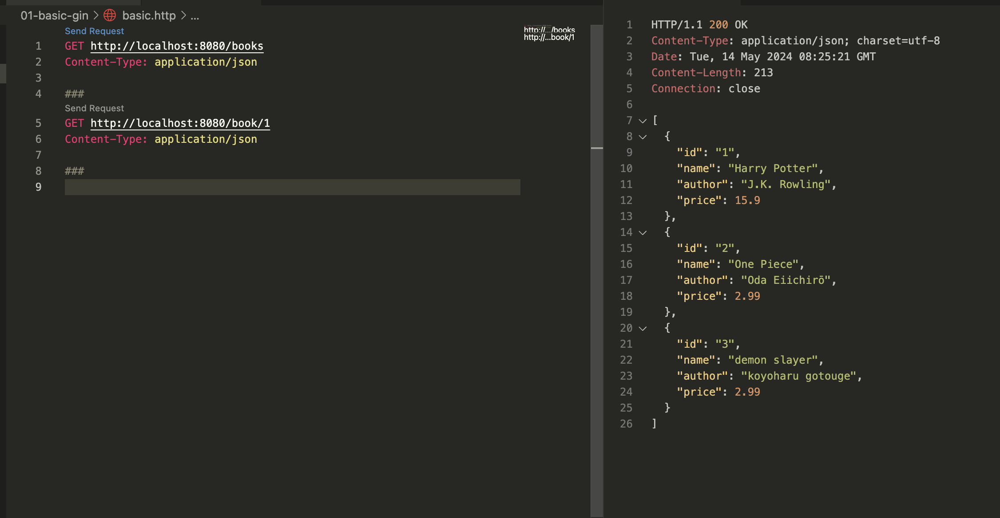

# 01 Get start Gin (GO)
 ref https://www.thinknet.co.th/things-we-learn/มาเขียน-restful-api-ง่ายๆ-ด้วย-gin-กันเถอะ
- install <a href="https://go.dev/dl/"> go </a>
- init go
```go
go mod init example/gin
```
- install gin
```go
go get -u github.com/gin-gonic/gin
```
- run server
```
go run main.go
```

- request api
    * open `basic.http`
    * run click `Send Request`
     </img>